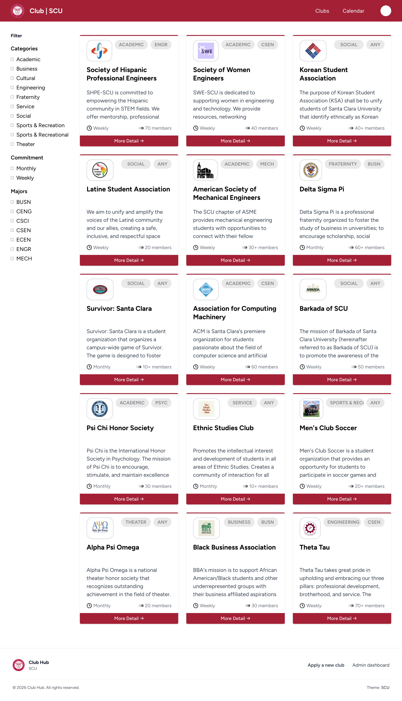
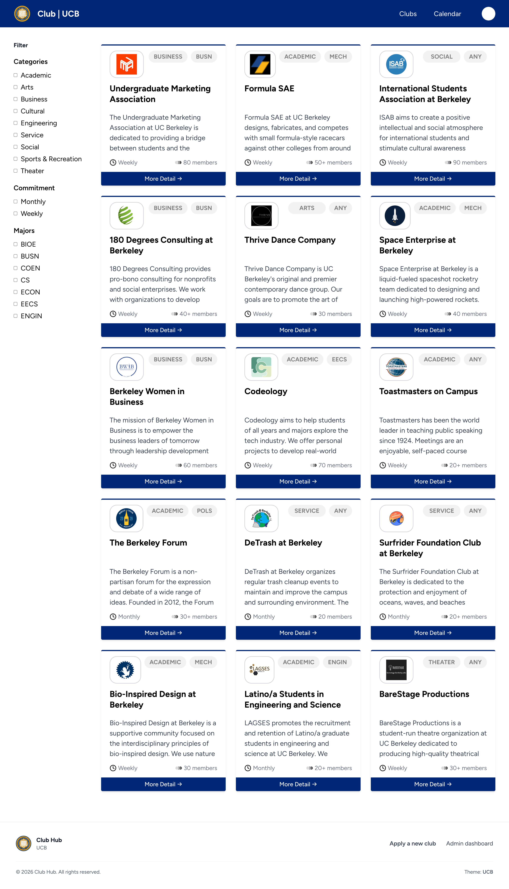
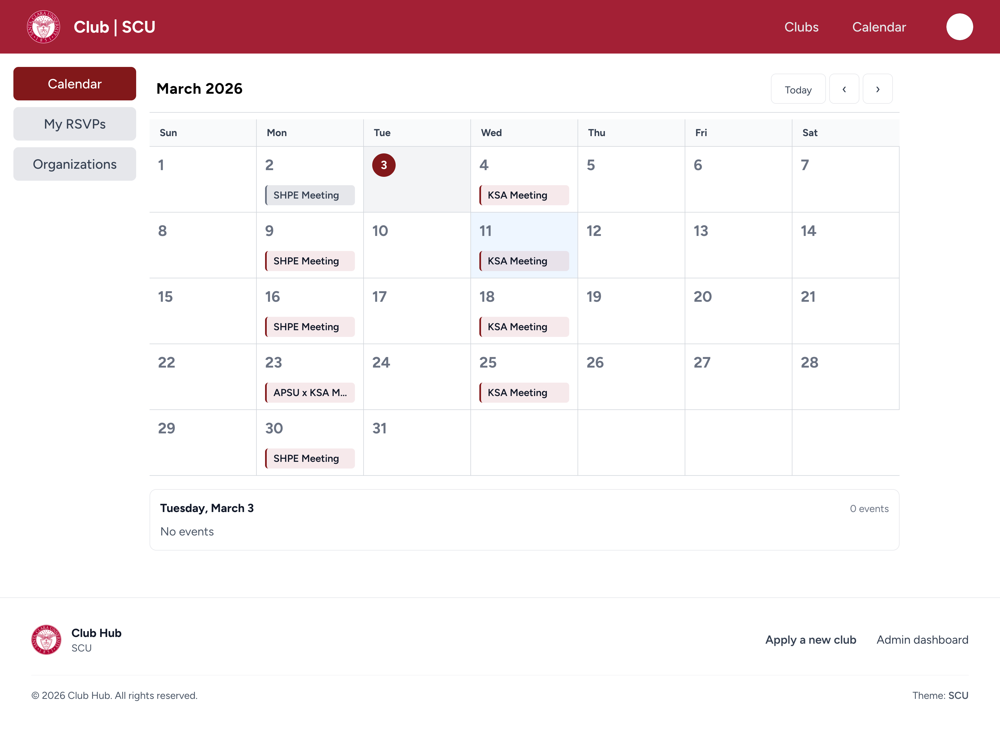

# University Club Hub

University Club Hub is a multi-school directory for discovering student clubs, browsing events, and submitting new club requests. The experience is themed per campus and includes an application process for new clubs.

Check the page out at [https://austinkimchi.github.io/university-club-hub/](https://austinkimchi.github.io/university-club-hub/)


## Screenshots







## Features

- School picker with per-campus theming, logos, and color palettes.
- Clubs directory with filters for categories, commitment level, and majors.
- Club detail pages with logos and descriptions.
- Calendar view for club events with day-based highlights.
- Club application form with validation and logo upload preview.
- Admin dashboard to review, approve, reject, or delete applications (local storage demo).

## Tech Stack

- React 19 + TypeScript
- Vite 7
- React Router
- Tailwind CSS

## Getting Started

```bash
npm install
```

```bash
npm run dev
```

Build for production:

```bash
npm run build
```

Preview the production build:

```bash
npm run preview
```

## Project Structure (Example)

- `public/scu` and `public/ucb` contain school-specific data, logos, and club assets.
- `public/scu/clubs.json` and `public/ucb/clubs.json` power the directory.
- `public/scu/club_events.json` and `public/ucb/club_events.json` power the calendar.
- `public/scu/info.json` and `public/ucb/info.json` provide theming data.
- `src/components/Form.tsx` and `src/components/Dashboard.tsx` store applications in local storage.

## Current Routes

- `/` or `/clubs` for the clubs directory.
- `/clubs/:id` for club detail pages.
- `/calendar` for the event calendar.
- `/apply` for the club application form.
- `/admin` for the admin dashboard.

## Deployment

The repository includes a `deploy` script for GitHub Pages:

```bash
npm run deploy
```
